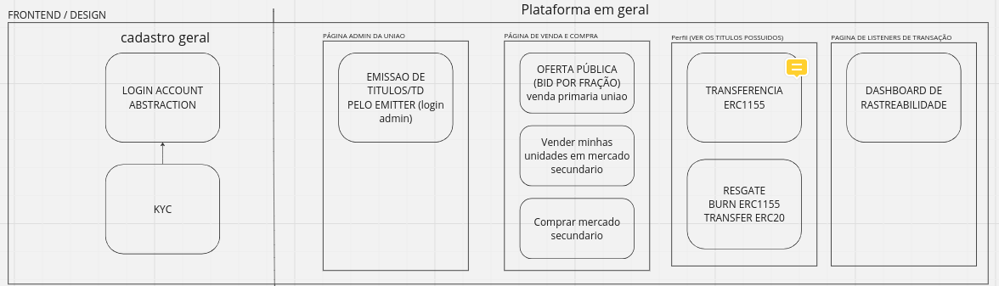
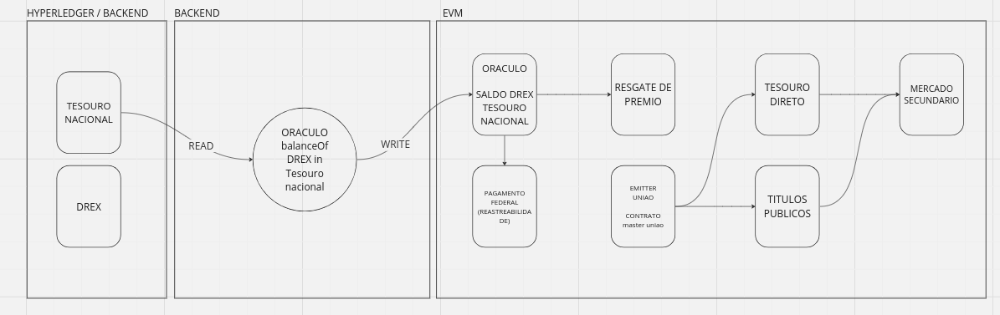

# Bem vindos aos Smart Contracts do TechSouro:

- Confira o Fluxo completo:




- O fluxo acima se trata dos seguintes contrato:

```txt
src
├─ TesouroDireto — Responsavel pela emissao de titulos pela Administracao publica.
├─ mercadoAberto — Responsavel pela realizacao do fracionamento e oferta publica na plataforma.
```


- Fluxo dos contratos referente a aplicacao no DREX e HYperledger Besu:



```txt
src
├─ oracleDREX — Contrato de Oracle em blockchain publica onde o tesouro atualiza as informacoes e escreve para o funcionamento correto entre diferentes blockchains e suas atualizacoes.
├─ VaultSimple — Um contrato de rastreabilidade e deposito de DREX.
```

### Entenda os contratos referente a interoperabilidade utilizando o protocolo da Chainlink CCIP (Cross Chain):

- obs. Como o protocolo e muito recente, nao esta aberto para o publico a utilizacao em redes permissionadas, ja possuem aplicacoes reais com permissionadas e vamos simular esse uso com blockchains publicas.

- Os contratos abaixo sao os mais importantes referentes ao CCIP:

```txt
src
├─ SourceMinterTesouro — Contrato responsavel que interage com o Tesouro direto e emite o tesouro entre redes diferentes.
├─ DestinationMinterTesouro — Contrato que define a destinacao e a rota utilizando o contrato da ChainLink que faz a comunicacao entre redes distintas.
```

### Como usar o CCIP emission Tesouro Direto:

- Scritp de deploy do NFT já setado a destinação. O comando de run inserimos a netowork de destinaçao que os parametros estão em uma enum do contrato Helpers chamada SupportedNetworks. Portando a network "0" seria a sepolia.

`forge script ./script/TesouroCrossChain.s.sol:DeployDestination -vvv --broadcast --rpc-url sepolia --sig "run(uint8)" -- 0 --verify -vvvv`

- Deve aparecer a seguinte mensagem:

== Logs ==
  Address of mercadoAberto:  0x6a8D22941b0877daEce7ed395dF004001E34F2a2
  Address of tesourodireto:  0x0000000000000000000000000000000000000000
  tesourodireto deployed on  Ethereum Sepolia with address:  0x3ad7065a4d1146c8bb8ca3A166924b88EF98ED80
  DestinationMinter deployed on  Ethereum Sepolia with address:  0x566423De5FcDED4D6Be7ab3c87e744b8A6238C47
  Minter role granted to:  0x566423De5FcDED4D6Be7ab3c87e744b8A6238C47
 

`forge script ./script/TesouroCrossChain.s.sol:DeploySource -vvv --broadcast --rpc-url mumbai --sig "run(uint8)" -- 4 --verify -vvvv`

- Meu endereço:

   == Logs ==
  == Logs ==
  SourceMinter deployed on  Polygon Mumbai with address:  0x4c2Ba8a38F5A16a04C6640949716b4c70522E143

- Devemos financiar o contrato acima com LINK para funcionar as proximas etapas.


- Agora conseguimos mintar o NFT que está na sepolia pela mumbai, com o seguinte comando:

`forge script ./script/TesouroCrossChain.s.sol:Mint -vvv --broadcast --rpc-url mumbai --sig "run(address,uint8,address,uint8)" -- 0x7Ad4A4049885e3c3eCa359fC32Cd84730b5CBbbD 0 0xF5bBA6D41bf6aE69598C0A8aF5cf8fFDB0933A69 1`

- Verifique:
`forge verify-contract 0x6ec34D04a5F321F854a8fEd1a754fC54B61f59fc src/cross-chain-nft-minter/SourceMinterTesouro.sol:SourceMinter --chain-id 80001 --num-of-optimizations 1000000 --watch --constructor-args $(cast abi-encode "constructor(address,address)" 0x70499c328e1E2a3c41108bd3730F6670a44595D1 0x326C977E6efc84E512bB9C30f76E30c160eD06FB) \--etherscan-api-key EBDF8WC3ADE16T9YUD9Y81F8TJJF52FG7E`

`forge verify-contract 0x6ec34D04a5F321F854a8fEd1a754fC54B61f59fc src/cross-chain-nft-minter/SourceMinterTesouro.sol:SourceMinter --chain-id 80001 --num-of-optimizations 1000000 --watch --constructor-args $(cast abi-encode "constructor(address,address)" 0x70499c328e1E2a3c41108bd3730F6670a44595D1 0x326C977E6efc84E512bB9C30f76E30c160eD06FB) \--etherscan-api-key EBDF8WC3ADE16T9YUD9Y81F8TJJF52FG7E`

Comandos para verificar:

`forge verify-contract 0x45c41FeDC33e85047B60D448FC4eF16981822A09 src/mercadoAberto.sol:openMarket --chain-id 11155111 --num-of-optimizations 1000000 --watch --constructor-args $(cast abi-encode "constructor(string,address,address)" "testURI" 0x60e20aC02Ccf5C35056C6b698DBbbe0e662bf1dB 0x5bb7dd6a6eb4a440d6C70e1165243190295e290B) \--etherscan-api-key ECJCCZZKNZEH8Z8P2EJ6GCE7G7YCRFTRZA


forge verify-contract 0x4978A4140DF1245d19430BAe86Aa954bD33BCf07 src/TesouroDireto.sol:tesouroDireto --chain-id 11155111 --num-of-optimizations 1000000 --watch --constructor-args $(cast abi-encode "constructor(string,string,address,address)" "Tesouro Direto" "TD" 0x45c41FeDC33e85047B60D448FC4eF16981822A09 0x60e20aC02Ccf5C35056C6b698DBbbe0e662bf1dB) \--etherscan-api-key ECJCCZZKNZEH8Z8P2EJ6GCE7G7YCRFTRZA

forge verify-contract 0x60e20aC02Ccf5C35056C6b698DBbbe0e662bf1dB src/OracleDREX.sol:oracleDrex --chain-id 11155111 --etherscan-api-key ECJCCZZKNZEH8Z8P2EJ6GCE7G7YCRFTRZA


forge verify-contract 0x45c41FeDC33e85047B60D448FC4eF16981822A09 src/mercadoAberto.sol:openMarket --chain-id 11155111 --num-of-optimizations 1000000 --watch --constructor-args $(cast abi-encode "constructor(string,address,address)" "testURI" 0x60e20aC02Ccf5C35056C6b698DBbbe0e662bf1dB 0x5bb7dd6a6eb4a440d6C70e1165243190295e290B) \--etherscan-api-key ECJCCZZKNZEH8Z8P2EJ6GCE7G7YCRFTRZA
Start verifying contract `0x45c41fedc33e85047b60d448fc4ef16981822a09``

- O contrato e os parametros:
https://mumbai.polygonscan.com/address/0x94673693c7C8201FACAdE1ff62AB3f760A81DF1d#writeContract

receive: 0x929168FE46576F5d51c552fe145ec918D8D25d04

payfeesIn:
1


https://mumbai.polygonscan.com/tx/0xd1368c001ff1aa7cc39d73e7cd69e8aa0684a77bb4047ffb9f8b40a37d7b790f

- pegue o hash da sua operacao igual ao exemplo acima e insira no CCIP Explorer:

https://ccip.chain.link/msg/0x7a8049d3b218e9e6c63fb99635b38990aa6ad36f4b6cdef9f3e19c7bbda4f2a2

- Feito isso veja o sua comprovacao de emissao entre a blockchain Mumbai e mint na Sepolia e no futuro sera na rede do DREX. Portanto, interoperabilidade entre blockchain publica e privada.

# Foundry Template [![Open in Gitpod][gitpod-badge]][gitpod] [![Github Actions][gha-badge]][gha] [![Foundry][foundry-badge]][foundry] [![License: MIT][license-badge]][license]

[gitpod]: https://gitpod.io/#https://github.com/PaulRBerg/foundry-template
[gitpod-badge]: https://img.shields.io/badge/Gitpod-Open%20in%20Gitpod-FFB45B?logo=gitpod
[gha]: https://github.com/PaulRBerg/foundry-template/actions
[gha-badge]: https://github.com/PaulRBerg/foundry-template/actions/workflows/ci.yml/badge.svg
[foundry]: https://getfoundry.sh/
[foundry-badge]: https://img.shields.io/badge/Built%20with-Foundry-FFDB1C.svg
[license]: https://opensource.org/licenses/MIT
[license-badge]: https://img.shields.io/badge/License-MIT-blue.svg

A Foundry-based template for developing Solidity smart contracts, with sensible defaults.

## What's Inside

- [Forge](https://github.com/foundry-rs/foundry/blob/master/forge): compile, test, fuzz, format, and deploy smart
  contracts
- [Forge Std](https://github.com/foundry-rs/forge-std): collection of helpful contracts and cheatcodes for testing
- [PRBTest](https://github.com/PaulRBerg/prb-test): modern collection of testing assertions and logging utilities
- [Prettier](https://github.com/prettier/prettier): code formatter for non-Solidity files
- [Solhint Community](https://github.com/solhint-community/solhint-community): linter for Solidity code

## Getting Started

Click the [`Use this template`](https://github.com/PaulRBerg/foundry-template/generate) button at the top of the page to
create a new repository with this repo as the initial state.

Or, if you prefer to install the template manually:

```sh
$ mkdir my-project
$ cd my-project
$ forge init --template PaulRBerg/foundry-template
$ pnpm install # install Solhint, Prettier, and other Node.js deps
```

If this is your first time with Foundry, check out the
[installation](https://github.com/foundry-rs/foundry#installation) instructions.

## Features

This template builds upon the frameworks and libraries mentioned above, so for details about their specific features,
please consult their respective documentation.

For example, if you're interested in exploring Foundry in more detail, you should look at the
[Foundry Book](https://book.getfoundry.sh/). In particular, you may be interested in reading the
[Writing Tests](https://book.getfoundry.sh/forge/writing-tests.html) tutorial.

### Sensible Defaults

This template comes with a set of sensible default configurations for you to use. These defaults can be found in the
following files:

```text
├── .editorconfig
├── .gitignore
├── .prettierignore
├── .prettierrc.yml
├── .solhint.json
├── foundry.toml
└── remappings.txt
```

### VSCode Integration

This template is IDE agnostic, but for the best user experience, you may want to use it in VSCode alongside Nomic
Foundation's [Solidity extension](https://marketplace.visualstudio.com/items?itemName=NomicFoundation.hardhat-solidity).

For guidance on how to integrate a Foundry project in VSCode, please refer to this
[guide](https://book.getfoundry.sh/config/vscode).

### GitHub Actions

This template comes with GitHub Actions pre-configured. Your contracts will be linted and tested on every push and pull
request made to the `main` branch.

You can edit the CI script in [.github/workflows/ci.yml](./.github/workflows/ci.yml).

## Writing Tests

To write a new test contract, you start by importing [PRBTest](https://github.com/PaulRBerg/prb-test) and inherit from
it in your test contract. PRBTest comes with a pre-instantiated [cheatcodes](https://book.getfoundry.sh/cheatcodes/)
environment accessible via the `vm` property. If you would like to view the logs in the terminal output you can add the
`-vvv` flag and use [console.log](https://book.getfoundry.sh/faq?highlight=console.log#how-do-i-use-consolelog).

This template comes with an example test contract [Foo.t.sol](./test/Foo.t.sol)

## Usage

This is a list of the most frequently needed commands.

### Build

Build the contracts:

```sh
$ forge build
```

### Clean

Delete the build artifacts and cache directories:

```sh
$ forge clean
```

### Compile

Compile the contracts:

```sh
$ forge build
```

### Coverage

Get a test coverage report:

```sh
$ forge coverage
```

### Deploy

Deploy to Anvil:

```sh
$ forge script script/Deploy.s.sol --broadcast --fork-url http://localhost:8545
```

For this script to work, you need to have a `MNEMONIC` environment variable set to a valid
[BIP39 mnemonic](https://iancoleman.io/bip39/).

For instructions on how to deploy to a testnet or mainnet, check out the
[Solidity Scripting](https://book.getfoundry.sh/tutorials/solidity-scripting.html) tutorial.

### Format

Format the contracts:

```sh
$ forge fmt
```

### Gas Usage

Get a gas report:

```sh
$ forge test --gas-report
```

### Lint

Lint the contracts:

```sh
$ pnpm lint
```

### Test

Run the tests:

```sh
$ forge test
```

Generate test coverage and output result to the terminal:

```sh
$ pnpm test:coverage
```

Generate test coverage with lcov report (you'll have to open the `./coverage/index.html` file in your browser, to do so
simply copy paste the path):

```sh
$ pnpm test:coverage:report
```

## Notes

1. Foundry uses [git submodules](https://git-scm.com/book/en/v2/Git-Tools-Submodules) to manage dependencies. For
   detailed instructions on working with dependencies, please refer to the
   [guide](https://book.getfoundry.sh/projects/dependencies.html) in the book
2. You don't have to create a `.env` file, but filling in the environment variables may be useful when debugging and
   testing against a fork.

## Related Efforts

- [abigger87/femplate](https://github.com/abigger87/femplate)
- [cleanunicorn/ethereum-smartcontract-template](https://github.com/cleanunicorn/ethereum-smartcontract-template)
- [foundry-rs/forge-template](https://github.com/foundry-rs/forge-template)
- [FrankieIsLost/forge-template](https://github.com/FrankieIsLost/forge-template)

## License

This project is licensed under MIT.
